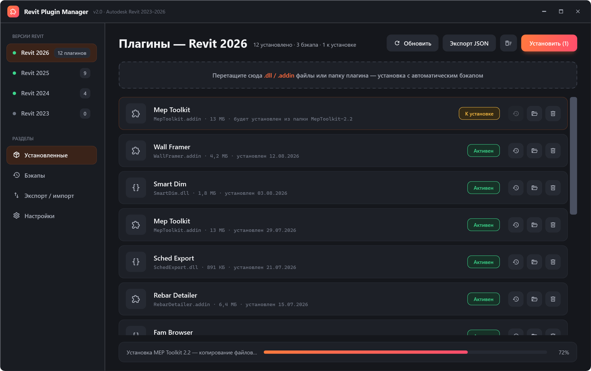
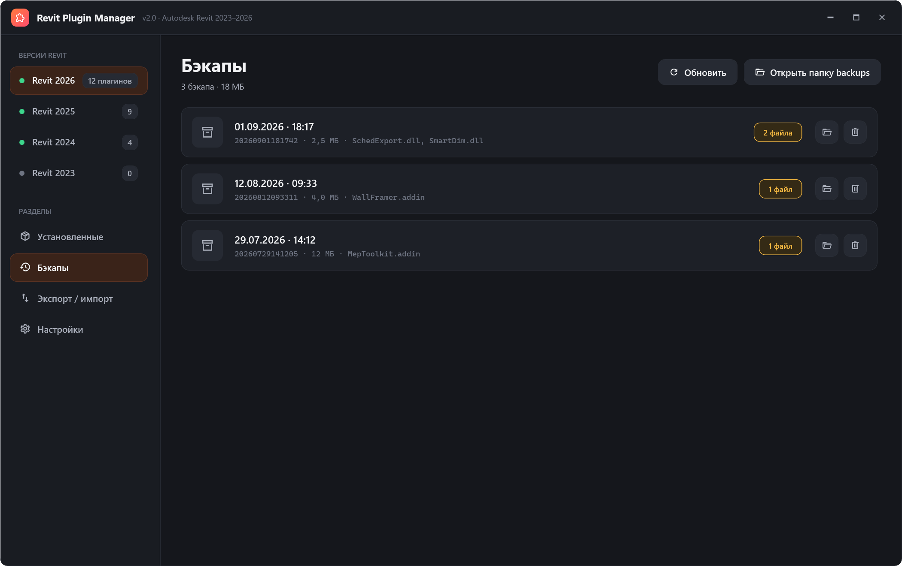
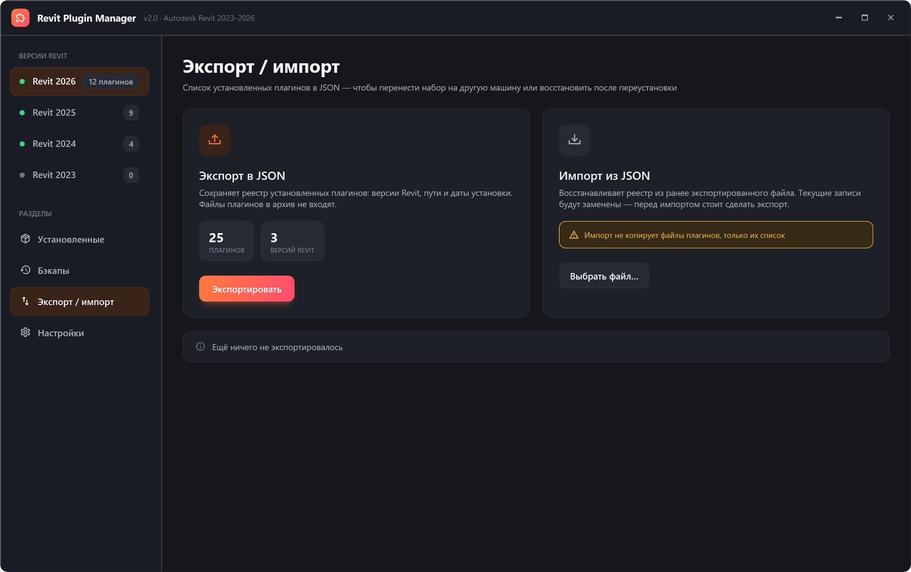
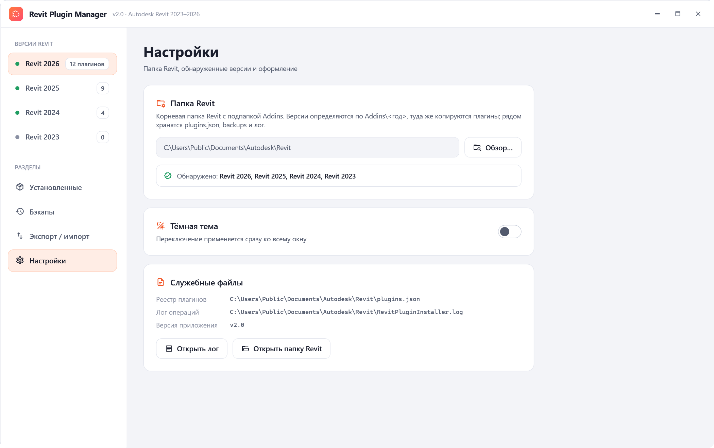

# Revit Plugin Manager

Десктопный менеджер плагинов для Autodesk Revit: кладёт файлы в нужную папку `Addins/<версия>`, делает бэкап при замене и удалении, ведёт учёт установленного и умеет переносить набор между машинами через JSON. WPF, MVVM, кастомное окно с боковой навигацией, тёмная и светлая темы.



## Что умеет

- Определяет установленные версии Revit по папке `Addins` и показывает их в боковой панели со счётчиком плагинов
- Устанавливает плагины перетаскиванием файлов или папок в окно, либо через диалог выбора; очередь установки видна в списке до нажатия «Установить»
- При установке поверх существующего плагина сначала делает бэкап, прогресс копирования — в строке состояния
- По каждому плагину: размер, дата установки, статус (активен / к установке / файл не найден), бэкап, открытие в проводнике, удаление с бэкапом
- Раздел «Бэкапы»: список резервных копий с датой, составом и размером, открытие и удаление
- Экспорт и импорт реестра плагинов в JSON
- Ведёт лог операций рядом с папкой Revit







## Стек

.NET 10 · WPF · MVVM (DI через `Microsoft.Extensions.DependencyInjection`) · Material.Icons.WPF · Newtonsoft.Json

## Запуск

```bash
cd RevitPluginInstaller/RevitPluginInstaller
dotnet run
```

При первом запуске приложение откроет «Настройки»: укажите папку Revit с подпапкой `Addins` — оттуда читается список версий, туда же копируются плагины. Рядом с папкой появятся `plugins.json` (реестр), `backups` и лог.

## Как устроено

- `Views/Windows/MainWindow` — окно без системной рамки: заголовок, сайдбар с версиями и разделами, `Frame` для страниц
- `Views/Pages` — четыре раздела: установленные (`DownloadPage`), бэкапы, экспорт/импорт, настройки; каждая страница получает свою view-model через DI
- `Services/PluginService` — установка, удаление, бэкапы, реестр `plugins.json`; событие `PluginsChanged` обновляет счётчики в сайдбаре
- `Resources/Themes` — семантическая палитра (`App.Surface`, `App.Accent`, …) в двух вариантах, стили контролов используют только её
- `RevitPluginInstaller.Screenshots` — вспомогательный проект, который поднимает окно с демо-данными вне экрана и рендерит PNG для этого README:

```bash
cd RevitPluginInstaller
dotnet run --project RevitPluginInstaller.Screenshots -- ../docs/screenshots 1.5
```

## Статус

Рабочий: установка, удаление (по одному и все разом), бэкапы, экспорт/импорт — проверены руками. Интерфейс дополнительно прогоняется офскрин-рендером из проекта скриншотов: все четыре раздела строятся и биндятся на демо-данных без ошибок привязок. Автотестов нет.
