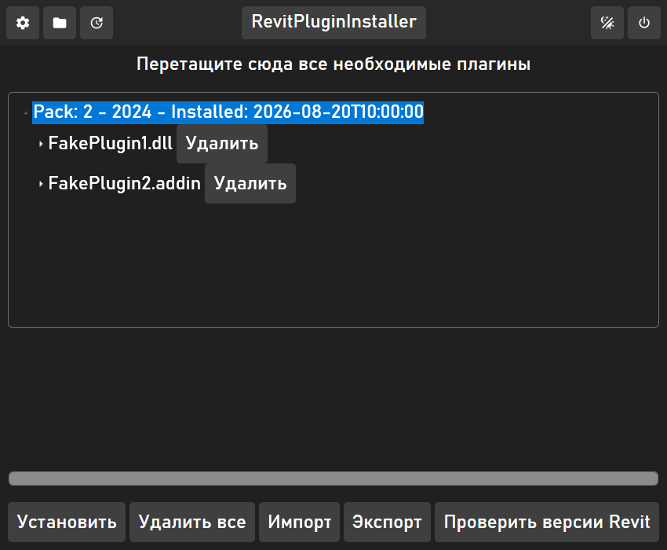
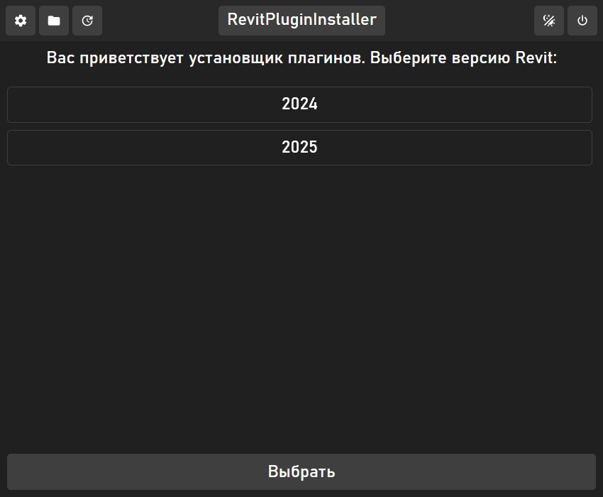

# Revit Plugin Installer

Десктопный менеджер плагинов для Autodesk Revit: устанавливает файлы в нужную папку `Addins/<версия>`, делает бэкап при замене, ведёт учёт установленного и умеет откатывать всё разом. WPF, MVVM, без модального ада — drag-and-drop вместо диалогов там, где это уместно.



## Что умеет

- Определяет, какие версии Revit установлены, по папке `Addins`
- Устанавливает плагины перетаскиванием файлов или папок, с прогресс-баром по каждому файлу
- При установке поверх существующего плагина делает бэкап перед заменой
- Удаляет один плагин или все разом — тоже с бэкапом
- Экспортирует и импортирует список установленных плагинов в JSON
- Ведёт лог операций рядом с папкой Revit



## Стек

.NET 10 · WPF · MVVM (DI через `Microsoft.Extensions.DependencyInjection`) · Newtonsoft.Json

## Запуск

```bash
cd RevitPluginInstaller/RevitPluginInstaller
dotnet run
```

При первом запуске откройте настройки (шестерёнка) и укажите папку установки Revit — оттуда приложение читает список версий из `Addins/<версия>`.

## Статус

Рабочий: установка, удаление (по одному и все разом), бэкапы, экспорт/импорт — проверены руками. Автообновление плагинов из интернета задумывалось изначально, но не реализовано — страница «Обновления» сейчас заглушка с пометкой «Скоро». Автотестов нет.
